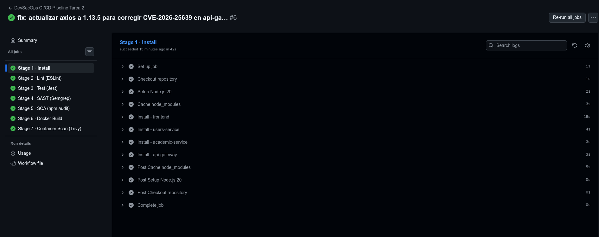
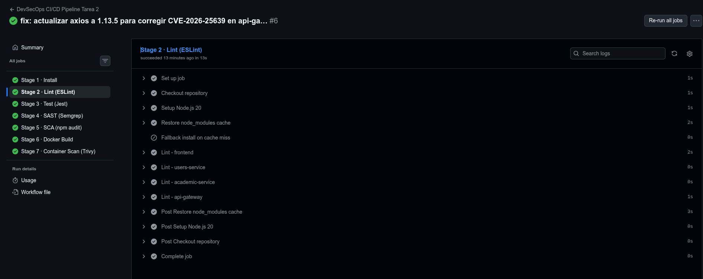
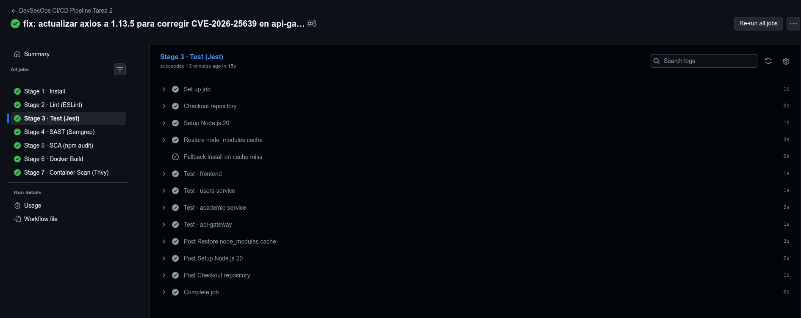
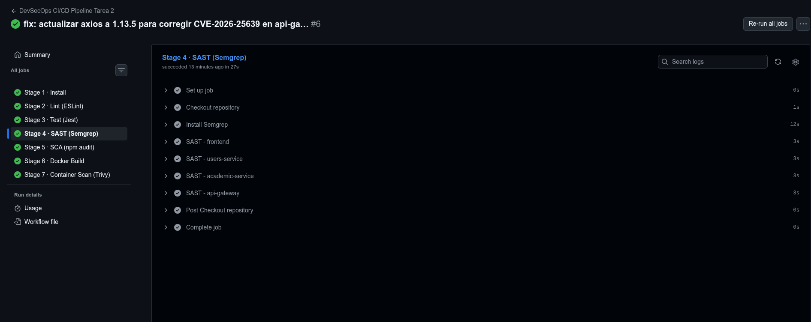
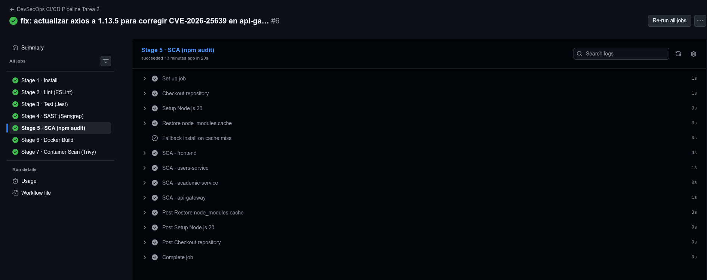
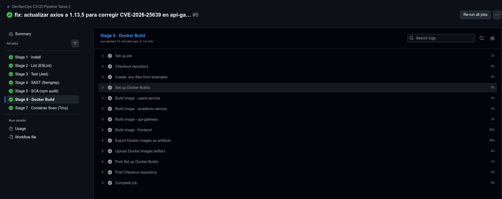
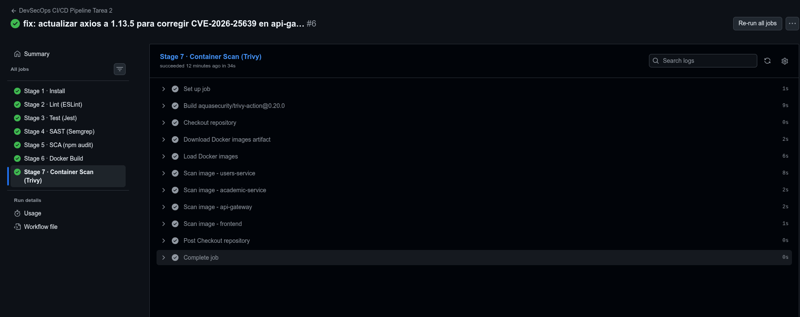

# Justificación Técnica del Pipeline DevSecOps

## Contexto

Un sistema que "funciona en producción" no es sinónimo de un sistema seguro, mantenible ni reproducible. El pipeline automatiza controles que, si se omiten, dependen de la disciplina humana — la cual falla bajo presión, en cambio de equipo o en deployments nocturnos. Cada herramienta actúa como una barrera técnica que hace imposible ignorar un problema, no solo visible.

---

## Herramientas

### 1. `npm ci` — Instalación reproducible

| Campo | Detalle |
|---|---|
| **Fase DevSecOps** | Build |
| **Riesgo mitigado** | Builds no deterministas; dependencias inconsistentes entre entornos |
| **Sin esta herramienta** | `npm install` resuelve versiones "compatibles" según semver, pudiendo instalar una versión distinta en CI que en la máquina del desarrollador. Una actualización silenciosa puede introducir un bug o vulnerabilidad. |
| **Por qué aunque funcione** | El sistema puede funcionar hoy con la versión A de una librería y fallar mañana cuando CI instale la versión B. `npm ci` elimina esa variabilidad: falla explícitamente si `package-lock.json` no coincide con `package.json`, convirtiendo la inconsistencia en un error visible. |

---

### 2. ESLint — Análisis estático de calidad

| Campo | Detalle |
|---|---|
| **Fase DevSecOps** | Code |
| **Riesgo mitigado** | Bugs silenciosos, código inseguro por descuido (`eval`, variables indefinidas, comparaciones débiles con `==`) |
| **Sin esta herramienta** | Patrones peligrosos como `eval(userInput)` o variables no inicializadas pasan a producción sin advertencia. La revisión manual de código no escala ni es consistente. |
| **Por qué aunque funcione** | El código que pasa los tests puede contener `no-eval` violations, variables declaradas pero no usadas o comparaciones con coerción implícita. Estos no rompen el sistema hoy; crean deuda técnica y vectores de ataque que se materializan después. ESLint los bloquea en la fase más barata: antes del commit. |

---

### 3. Jest — Tests unitarios automatizados

| Campo | Detalle |
|---|---|
| **Fase DevSecOps** | Test |
| **Riesgo mitigado** | Regresiones funcionales; código que "funciona" pero rompe contratos establecidos |
| **Sin esta herramienta** | Cada cambio requiere verificación manual. Una modificación en `auth.facades.js` podría romper el login sin que nadie lo note hasta que un usuario lo reporte en producción. |
| **Por qué aunque funcione** | El sistema funciona con el código actual. Los tests protegen ese funcionamiento ante cambios futuros. Sin ellos, refactorizar o actualizar una dependencia es una apuesta: no hay forma automatizada de saber si algo se rompió. |

---

### 4. Semgrep — SAST (Análisis estático de seguridad)

| Campo | Detalle |
|---|---|
| **Fase DevSecOps** | Security (Code) |
| **Riesgo mitigado** | Vulnerabilidades conocidas en patrones de código: inyección, secretos hardcodeados, uso inseguro de criptografía |
| **Sin esta herramienta** | ESLint analiza calidad; Semgrep analiza seguridad con reglas escritas por expertos en vulnerabilidades específicas de Node.js (`p/nodejs`). Un `jwt.verify` sin manejo correcto o un `child_process.exec` con input no sanitizado pasarían desapercibidos. |
| **Por qué aunque funcione** | Las vulnerabilidades de seguridad raramente impiden que el sistema funcione; permiten que un atacante lo use de formas no previstas. El SAST las detecta antes de que lleguen al repositorio, cuando el costo de corrección es mínimo. |

---

### 5. `npm audit` — SCA (Análisis de composición de software)

| Campo | Detalle |
|---|---|
| **Fase DevSecOps** | Security (Build) |
| **Riesgo mitigado** | CVEs en dependencias de terceros; cadena de suministro comprometida |
| **Sin esta herramienta** | Una dependencia con una vulnerabilidad crítica conocida llega a producción. El proyecto usa `express`, `jsonwebtoken`, `bcrypt` — librerías con historial de CVEs. La superficie de ataque no es solo el código propio. |
| **Por qué aunque funcione** | El sistema funciona con `jsonwebtoken@9.0.3`. Si se publica un CVE crítico en esa versión, el sistema sigue funcionando — pero ahora es vulnerable. `npm audit` convierte ese riesgo en un error de pipeline que obliga a actualizar antes de deployar. |

---

### 6. Docker build con versionado por SHA — Trazabilidad de artefactos

| Campo | Detalle |
|---|---|
| **Fase DevSecOps** | Build / Deploy |
| **Riesgo mitigado** | Ambigüedad sobre qué código está desplegado; imposibilidad de rollback determinista |
| **Sin esta herramienta** | Usar solo `:latest` hace imposible responder "¿qué versión exacta está en producción?". Un rollback a `:latest` podría apuntar a una imagen diferente dependiendo de cuándo se ejecutó. |
| **Por qué aunque funcione** | En un incidente de seguridad o bug en producción, la primera pregunta es "¿qué está corriendo exactamente?". `image:abc1234` responde esa pregunta de forma inequívoca y permite vincular cada imagen a su commit, sus tests y sus resultados de Trivy. |

---

### 7. Trivy — Escaneo de vulnerabilidades en imágenes de contenedor

| Campo | Detalle |
|---|---|
| **Fase DevSecOps** | Security (Build) |
| **Riesgo mitigado** | CVEs en la imagen base del OS (Alpine), binarios del sistema y paquetes npm embebidos en la imagen |
| **Sin esta herramienta** | `npm audit` analiza dependencias del proyecto; Trivy analiza la imagen Docker completa. `node:20-alpine` puede contener librerías del sistema operativo con CVEs críticos que `npm audit` no detecta. |
| **Por qué aunque funcione** | La imagen podría contener OpenSSL, libcurl u otras librerías del sistema con vulnerabilidades explotables independientemente de si la aplicación Node.js funciona correctamente. Trivy cierra la brecha entre "el código es seguro" y "el contenedor que lo ejecuta también lo es". |

---

## Evidencia de ejecución

### Pipeline completo — todos los stages pasando

---

## Conclusión

Ninguna de estas herramientas es redundante con las demás: operan en capas distintas del mismo sistema. ESLint no detecta CVEs en dependencias; Trivy no encuentra patrones inseguros en el código fuente; Jest no sabe si una librería tiene una vulnerabilidad publicada. La cadena completa `Calidad → Tests → SAST → SCA → Build → Scan` garantiza que un artefacto que llega a producción fue validado en todas esas dimensiones, de forma automatizada y sin depender de criterio humano variable.
